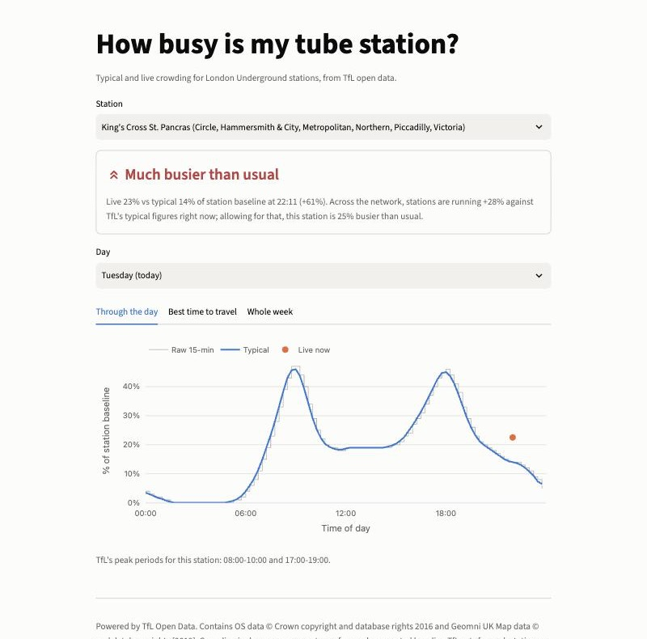
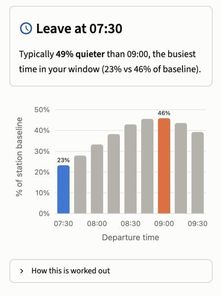

# How busy is my tube station?

[](https://github.com/OWNER/tube-crowding/actions/workflows/ci.yml)

**Live app:** LIVE_URL

Pick a London Underground station and see how busy it usually is through the day and week,
whether it's busier or quieter than normal right now, and the least crowded time to set off
within a window you choose. Built on TfL's open crowding data, and designed for a phone.

<p>
  
  
</p>

## Why I built it

I've just moved to London and quickly learnt that a 15-minute shift in when you leave can be
the difference between a seat and a crush. TfL publishes the data to answer that, but only as
raw JSON. This project takes that messy source all the way to a deployed, tested product:
API client → typed models → pure analysis functions → UI.

## Features

- **Station search** across all 270 tube stations. Names that appear twice (Hammersmith,
  Edgware Road, Paddington) are told apart by their lines.
- **Live vs typical:** a plain-English verdict ("busier than usual") with the numbers behind it.
- **Typical day:** crowding in 15-minute bands, raw and smoothed, with the live reading marked.
- **Best time to travel:** give a window (e.g. leaving 07:30–09:30) and get the quietest
  departure and how much quieter it is than the busiest one. Windows across midnight work.
- **Week heatmap:** day of week × time of day.
- The selected station is kept in the URL, so a view can be shared.

## How it works

### The data
`GET /crowding/{naptan}` returns typical crowding for each day of the week in 96
fifteen-minute bands. `GET /crowding/{naptan}/Live` returns the latest reading on the same
scale. Values are a **fraction of a baseline TfL sets per station**. TfL doesn't document the
baseline, so the app only ever compares a station with itself. Full findings from exploring the
API, including coverage and quirks, are in [docs/DATA_NOTES.md](docs/DATA_NOTES.md).

### Smoothing
TfL rounds every band to 0.01. For a quiet station peaking at 0.10, that's a 10% step, so the
raw profile looks jagged. I apply a **centred 3-band (45-minute) moving average**. It is short
enough not to move the peaks and long enough to remove the rounding noise. At the ends of the
day the window shrinks instead of wrapping into a different day. The raw values are still
drawn faintly behind the smoothed line, so nothing is hidden.

### Best time to travel
Each departure slot in your window is scored with the smoothed typical crowding for that band.
The recommendation is the slot with the **lowest** score; ties go to the earlier slot, which is
the safer advice. "Quieter by" compares it with the busiest slot in the same window:
`(busiest − quietest) / busiest`. If the window crosses midnight, the slots after midnight use
the next day's profile. The numbers behind the recommendation are one tap away.

### Live vs typical, and the network adjustment
The naive comparison is `live / typical` for the current 15-minute band. While building this I
found that live readings run **above** typical across the whole network. On the evening I
measured, the median ratio over 42 stations was 1.27, most likely because the typical profiles
predate current ridership. Taken at face value, almost every station would read "busier than
usual" every evening.

So the app samples 16 busy stations across lines and zones (fetched in parallel, cached for 5
minutes) and takes the **median** live/typical ratio as a network factor. Each station's verdict
uses `ratio / network factor`: is this station unusual *compared with how the whole network is
behaving right now*? The median stops one station with an event from skewing the factor. The
raw ratio is always shown alongside. Within ±10% counts as "usual". These thresholds are a
judgement call, not a calibrated model.

## Limitations

- **Typical patterns are historical averages, not a forecast of today.** They don't know about
  strikes, engineering works, events or the weather.
- Values are relative to an undocumented per-station baseline. They **can't be compared across
  stations** as crowd sizes.
- Crowding is measured at station level, not per platform, line or carriage.
- 17 of 270 tube stations have no usable data (e.g. Arsenal, Pimlico, Monument). TfL publishes
  no crowding data for the Elizabeth line, Overground or DLR.
- The live reading lags real time by a few minutes and refreshes about every 5 minutes.

## Run it locally

Needs Python 3.11+.

```bash
git clone https://github.com/OWNER/tube-crowding.git
cd tube-crowding
python -m venv .venv && source .venv/bin/activate
pip install -r requirements-dev.txt
cp .env.example .env   # optional: add a free key from api-portal.tfl.gov.uk
streamlit run app.py
```

Without a key the app still works, but TfL's anonymous rate limit is low. A free key gives
500 requests per minute.

## Tests and checks

```bash
pytest          # 53 tests: logic, parsing against saved real API responses, chart smoke tests
ruff check .    # lint
ruff format --check .
```

No test touches the network. Client tests use real TfL responses saved in `tests/fixtures/`,
including the awkward ones (unknown station, all-zero profile, duplicated bands). HTTP failures
are simulated with a fake session. GitHub Actions runs all of this on every push.

## Project structure

```
app.py                  Streamlit UI only: layout, caching, user-facing messages
tube/models.py          Typed dataclasses (Station, DayProfile, WeekProfile, LiveReading)
tube/client.py          TfL HTTP client + parsing into models; every failure becomes a friendly TflError
tube/logic.py           Pure functions: smoothing, best time, live vs typical, network factor
tube/charts.py          Plotly figure builders (no Streamlit)
tube/stations.py        Loads the static station list
tube/config.py          Reads the API key from the environment or .env
scripts/build_stations.py   Regenerates data/stations.csv from the TfL StopPoint API
tests/                  pytest suite + saved API fixtures
docs/DATA_NOTES.md      What I found exploring the API
```

The logic layer has no Streamlit and no network code, so it can be tested with small,
hand-checkable numbers. Caching sits at the UI edge: typical profiles for 24 hours, live
readings for 2 minutes, the network factor for 5 minutes.

## What I'd improve next

1. **Record live readings over time** to measure how noisy "live vs typical" really is, and
   calibrate the "usual" thresholds from data instead of judgement.
2. **A short-term forecast:** model the live deviation from typical (time of day, disruption,
   weather, events) to say "likely to be busier than usual in 30 minutes".
3. **Line status alongside the verdict** (TfL `/Line/Status`), so an unusually busy reading
   comes with a likely reason.
4. **Compare mode:** two stations side by side, comparing the *shape* of their days (since
   absolute levels aren't comparable).
5. **Journey view:** combine origin and destination crowding for a whole trip.

More ideas are in [V2_IDEAS.md](V2_IDEAS.md).

## Data source and licence

Powered by TfL Open Data. Contains OS data © Crown copyright and database rights 2016 and
Geomni UK Map data © and database rights [2019]. Used under TfL's
[transport data terms](https://tfl.gov.uk/corporate/terms-and-conditions/transport-data-service),
which are based on the Open Government Licence. Data comes only from the official Unified API;
nothing is scraped. This is a learning project and is not affiliated with or endorsed by TfL.
