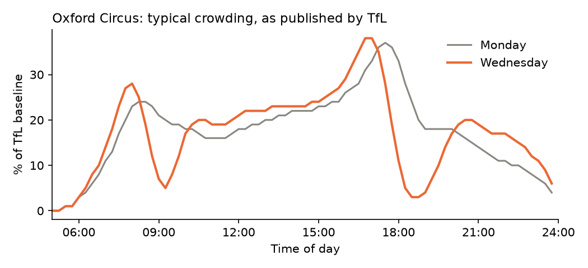
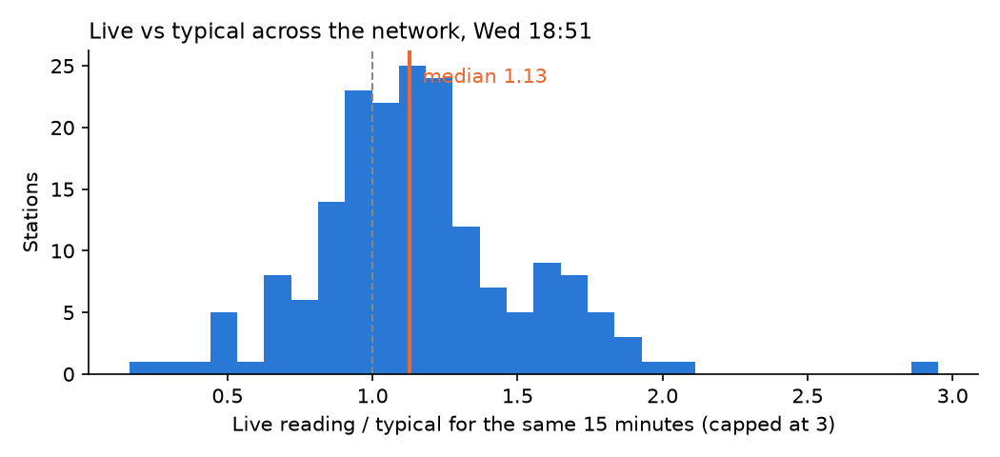

# What's wrong with TfL's crowding data

While building the app I found two problems with TfL's crowding data. Both would have made the app give bad advice if I'd used the numbers as they came. The charts are made by `python -m scripts.data_quality`.

## 1. Peaks that collapse to zero

Oxford Circus on a Monday looks like you'd expect: busy in the morning, busier in the evening. On Wednesday the morning peak at 08:00 is followed by a drop to almost nothing at 09:15, and the evening peak collapses at 18:30. Oxford Circus is not empty at 09:15 on a Wednesday.

It isn't just one station. Across the network, 17 stations have the same thing in their published typical profiles, nearly always on Tuesday, Wednesday and Thursday, around 09:00 and 18:30. Mondays and Fridays look fine. My guess is that something went wrong when TfL built the midweek profiles, but I can't confirm that from the outside.

Why it matters: the app's trip planner recommends the quietest time to leave. With this data it would tell you to leave Oxford Circus at 09:15 on a Wednesday.

What I do: if a band in the day falls below 30% of the busy times within two hours either side of it, I treat the whole day as broken. I replace it with the average of the station's other weekdays, and say so on the page. Waterloo is odd even after this, because its Monday has a smaller version of the same dip, so the page warns about it.

## 2. Live readings don't match the typical figures

Each bar counts stations by how their live reading compares with TfL's typical figure for the same 15 minutes. If the two were on the same footing, this would be centred on 1. It isn't. On Tuesday evening at 22:00 the median was 1.27. On Wednesday at 18:51 it was 1.13, and the middle half of stations were between 0.94 and 1.31.

So live readings run above typical across the board, by an amount that changes through the day. If you compare a station's live reading with its typical figure directly, most stations look "busier than usual".

What I do: the app checks 16 big stations, takes the median live/typical ratio, and divides each station's ratio by it. "Busier than usual" then means busier than the rest of the network is right now.

The spread is also wide. Even after this correction, one station being 20% above the network isn't unusual on its own. My "within 10% is normal" threshold is probably too tight, and I'd like to set it from data rather than by judgement.

## Smaller things

- 15 stations return a full week of zeros instead of "no data". 2 more return nothing.
- The live feed sometimes reports exactly zero for a busy station (Oxford Circus at 18:41 on a Wednesday). The app treats readings far from normal as a likely glitch.
- Live readings lag real time by about 5–10 minutes.
- Hammersmith (H&C) sends every 15-minute band twice, with different values.

## What I'm doing about it

A scheduled job (`.github/workflows/log-live.yml`) saves the live readings for 30 stations every 15 minutes to the `data` branch. With a few weeks of that I can measure how the drift changes by time and day, set the "busier than usual" threshold properly, and see whether "busier than usual" in the next hour can be predicted.
